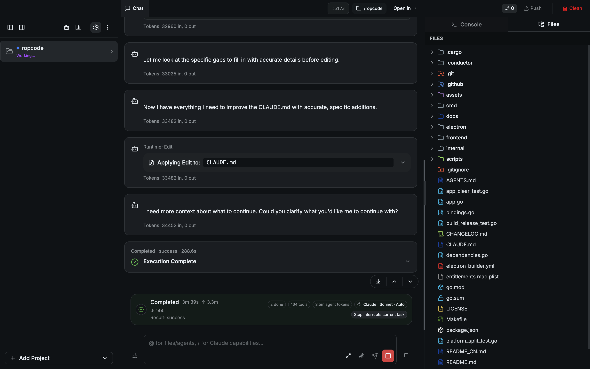
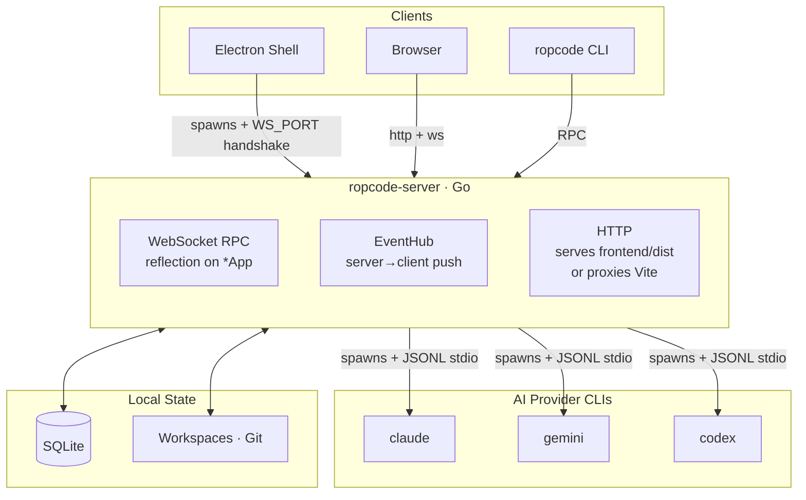

<a id="readme-top"></a>

<p align="center">
  
</p>

<h1 align="center">Ropcode</h1>

<p align="center">
  <strong>One workspace, many AI agents.</strong><br/>
  Run Claude Code, Gemini, and Codex side-by-side on the same project — in a real desktop IDE.
</p>

<p align="center">
  <a href="https://github.com/RubinCarter/ropcode/releases"></a>
  <a href="LICENSE"></a>
  
  <a href="https://github.com/RubinCarter/ropcode/stargazers"></a>
  <a href="https://github.com/RubinCarter/ropcode/issues"></a>
</p>

<p align="center">
  <a href="README.md"><strong>English</strong></a> ·
  <a href="README_CN.md">中文</a>
</p>

<p align="center">
  <a href="#-why-ropcode">Why</a> ·
  <a href="#-download">Download</a> ·
  <a href="#-quick-start">Quick Start</a> ·
  <a href="#-workspaces">Workspaces</a> ·
  <a href="#-features">Features</a> ·
  <a href="#-cli">CLI</a> ·
  <a href="#-architecture">Architecture</a> ·
  <a href="#-build-from-source">Build</a> ·
  <a href="#-roadmap">Roadmap</a>
</p>

<p align="center">
  
</p>

> [!TIP]
> Ropcode wraps the AI coding CLIs you already love (Claude Code, Gemini CLI, Codex) into a real desktop IDE. Open a project once and you can run **multiple agents from different providers on the same workspace** — sharing one file tree, one Git status, one terminal, and one diff view.

---

<a id="-why-ropcode"></a>

## ✨ Why Ropcode

- **One workspace, many agents.** Open a project once. Run Claude on the test suite while Gemini drafts docs while Codex refactors a module — all sharing the same files, Git, and terminal.
- **See the agent think and act.** Live subagent progress, streamed transcripts, side-by-side diffs, and an integrated xterm — all wired to the same session.
- **A real product, not a wrapper script.** Three binaries from one Go module — Electron shell, headless `ropcode-server`, and a `ropcode` CLI — all sharing the same WebSocket RPC core.
- **Cross-platform & cross-form-factor.** Native macOS, Linux, and Windows builds. The Go backend serves the UI itself, so the same instance works in a browser or on mobile.

---

<a id="-download"></a>

## 📥 Download

Pre-built installers are published on the [**Releases**](https://github.com/RubinCarter/ropcode/releases/latest) page.

| Platform | Format | Architectures |
| --- | --- | --- |
| macOS | `.dmg` | Apple Silicon (arm64) · Intel (x64) |
| Windows | `.exe` (NSIS) | x64 |
| Linux | `.AppImage` · `.deb` | x64 |

> [!IMPORTANT]
> **Ropcode is a GUI for AI coding CLIs — you need to install at least one of them yourself first:**
>
> - [Claude Code](https://docs.anthropic.com/en/docs/claude-code) — `npm install -g @anthropic-ai/claude-code`
> - [Gemini CLI](https://github.com/google-gemini/gemini-cli) — `npm install -g @google/gemini-cli`
> - [Codex](https://github.com/openai/codex) — follow OpenAI's installation guide
>
> Make sure the CLI is on your `PATH` before launching Ropcode.

---

<a id="-quick-start"></a>

## 🚀 Quick Start

1. **Install at least one provider CLI** (Claude Code, Gemini CLI, or Codex — see above). Install more than one if you want to mix them.
2. **Download Ropcode** for your OS from the [Releases](https://github.com/RubinCarter/ropcode/releases/latest) page and install it.
3. **Open a workspace**: launch Ropcode → *Open Project* → pick a folder → start chatting.

That's it. Tabs, sessions, diff views, and Git status are all live from the first keystroke.

---

<a id="-workspaces"></a>

## 🗂️ Workspaces: one project, many agents

A **workspace** in Ropcode is a project directory. Open it once and you get a shared context that every agent in that workspace sees.

Inside a single workspace you can:

- 🤝 **Run sessions from multiple CLIs in parallel** — Claude, Gemini, and Codex side-by-side on the *same* codebase. No copying files, no rebooting state.
- 🧠 **Pick the right model per task.** Use one provider for refactoring, another for tests, a third for docs — switch without losing chat history.
- 📁 **Share one file tree, one Git status, one terminal, one diff view** across every session in the workspace.
- 💾 **Resume on restart.** Sessions, queued prompts, and conversation history are persisted per workspace.

You can also open as many workspaces as you want, each in its own tab — so cross-project parallelism (e.g. backend + mobile + design system) works exactly the same way.

The CLI thinks in workspaces too: every `ropcode workspace ...` command targets a `--cwd` and operates on the same workspace the GUI sees. See [CLI](#-cli) below.

---

<a id="-features"></a>

## 🎯 Features

### 🌍 Multi-provider AI

Switch between Claude, Gemini, and Codex per-session, per-workspace — or run them all at once. Pin your favorite model, configure custom API endpoints, and route different tasks to different providers without restarting anything.

### 🧠 Parallel agent sessions

Open as many workspaces and sessions as you want, each in its own tab with its own working directory, model, and chat history. Sessions resume on restart with full conversation state — including queued prompts that haven't been sent yet.

### 👥 Live subagent progress

When Claude spawns subagents or background tasks, Ropcode tracks each one in a grouped panel with live transcript loading. See exactly which child agent is doing what, when it started, when it finished, and what it produced — without scrolling through a wall of stream-json.

### 🔀 Side-by-side diff viewer

Every file the agent touches lights up in the right sidebar with a side-by-side diff and inline change navigation. Review, accept, or jump straight to the file in your editor.

### 🖥️ Integrated terminal

Full xterm.js with WebGL rendering, Powerline-friendly Unicode 11, web-links, and search. Run your dev server right next to your agent — no app-switching.

### 🌳 Real-time Git status

A native Go file watcher pushes Git status changes to the UI the moment they happen. Branch, ahead/behind, modified/staged — always current, never refresh-bound.

### ⚡ Slash commands & capability picker

Type `/` to fan out into every slash command available in this session: built-ins, project commands, user commands, and skills — all unified in one picker, all warm-cached on startup so the menu opens instantly.

### 🔌 MCP server management

Browse, configure, and toggle Model Context Protocol servers in a dedicated UI. Add tools and data sources without hand-editing JSON.

### 🔄 Multi-instance switcher

Run multiple Ropcode instances on the same machine and jump between them from the titlebar. Useful for keeping work and personal projects fully isolated.

### 📊 Usage analytics

Token spend, model breakdown, daily trend lines, and per-workspace rollups. Catch runaway agents before your bill does.

### 📱 Mobile-friendly

Because the Go backend serves the UI itself, you can point your phone's browser at a running `ropcode-server` and get a fully responsive layout — bottom tab bar, iOS keyboard handling, WebSocket auto-reconnect.

### 🌐 SSH remote project sync

Pull a project from a remote machine over SSH, work on it locally, and sync changes back. Built in — no extra service to install.

---

<a id="-cli"></a>

## ⌨️ CLI

Ropcode isn't only a GUI. The same `ropcode-server` exposes a typed RPC surface that the bundled `ropcode` CLI talks to — so you can script agents from your shell while the GUI stays open in another window. Everything is workspace-scoped via `--cwd`.

```bash
# Send a prompt to a workspace (auto-picks the active provider, or use --provider)
ropcode workspace send --cwd ./my-project --prompt "add unit tests for the auth module"

# Same workspace, different provider — runs side-by-side
ropcode workspace send --cwd ./my-project --provider gemini --prompt "draft README"

# Tail logs
ropcode workspace logs --cwd ./my-project --follow

# Snapshot status
ropcode workspace status --cwd ./my-project

# Attach to a running session in a TUI
ropcode runtime tui --instance <id>
```

The Electron app can install the CLI to your `PATH` from the in-app menu (`Help → Install Ropcode CLI`), or you can build it standalone — see [Build from Source](#-build-from-source).

---

<a id="-how-is-this-different-from-opcode"></a>

## 🤔 How is this different from opcode?

Ropcode is a from-scratch rewrite inspired by [opcode](https://github.com/winfunc/opcode), with a different architecture and a broader scope:

| | **Ropcode** | **opcode** |
| --- | --- | --- |
| Desktop framework | Electron | Tauri |
| Backend language | Go | Rust |
| AI providers | Claude · Gemini · Codex | Claude only |
| Multi-CLI per workspace | ✅ Run providers side-by-side on one project | — |
| Standalone CLI | ✅ Connects to running server via RPC | — |
| Headless server mode | ✅ Run without Electron, use any browser | — |
| Real-time Git watcher | ✅ | — |
| MCP integration | ✅ | ✅ |
| SSH remote project sync | ✅ | — |
| Multi-instance | ✅ | — |
| Mobile-responsive UI | ✅ | — |
| License | AGPL-3.0 | AGPL-3.0 |

If you're happy with a Tauri/Rust stack and Claude-only, opcode is great. Ropcode is for people who want a single product spanning desktop, browser, mobile, and CLI — across multiple AI providers — and don't mind a Go backend.

---

<a id="-architecture"></a>

## 🏗️ Architecture

One Go module, three binaries, one WebSocket RPC core.



**Three runtime surfaces from one module:**

- **`ropcode-server`** — the Go WebSocket backend. Runs standalone or under Electron. Picks a free port, prints `WS_PORT:<port>`, and serves the frontend itself (reverse-proxies Vite in dev, serves `frontend/dist` in prod). The browser only ever talks to Go — never directly to Vite.
- **Electron shell** — spawns `ropcode-server` as a child process, generates a per-session auth key, and loads the window pointing at the Go server.
- **`ropcode` CLI** — dials the same WebSocket and reuses the same RPC types as the frontend.

**Two design choices worth knowing:**

- **Reflection-based RPC.** `internal/websocket/router.go` reflects every exported method on `*App` and exposes it as an RPC endpoint. Adding a new frontend-callable API is one Go method + one typed wrapper in `frontend/src/lib/rpc-client.ts` — no manual route table.
- **Single push channel.** `internal/eventhub/hub.go` is the only path for server-to-client events (`git:changed`, `process:changed`, `session:changed`, …). Managers emit through small adapter structs, which keeps the abstraction stable when transports change.

For deeper notes, see `CLAUDE.md`, `AGENTS.md`, and the dated design docs in `docs/plans/`.

---

<a id="-build-from-source"></a>

## 🛠️ Build from Source

### Prerequisites

- Go 1.24+
- Node.js 22+ and npm
- One of: `claude`, `gemini`, or `codex` on your `PATH`

### Run in development

```bash
make dev
```

This builds the Go server, starts Vite, and launches the Electron window — all wired together via the `WS_PORT` handshake described above.

### Build a redistributable

```bash
# Production-quality build for the current OS
make build

# Full electron-builder pipeline (DMG / NSIS / AppImage)
npm run build:release
```

### Useful targets

| Command | Purpose |
| --- | --- |
| `npm run build:go` | Server (`-tags server`) + CLI (per-platform layout) |
| `npm run build:cli:dev` | CLI only, flat output at `bin/ropcode` |
| `go test ./...` | All Go tests |
| `cd frontend && npm run build:typecheck` | Frontend typecheck + build |
| `cd electron && npm test` | Electron main-process tests |

> [!NOTE]
> A plain `go build .` will not produce a runnable server — `server_main.go` is behind the `server` build tag. Always pass `-tags server`, or use the npm scripts.

---

<a id="-roadmap"></a>

## 🗺️ Roadmap

A few things on deck (track via [Issues](https://github.com/RubinCarter/ropcode/issues)):

- 📐 Context-usage breakdown UI (system / tools / history / memory / MCP)
- ⏪ File checkpoint and rewind
- 🧩 Hot MCP server toggle, reconnect, and elicitation support
- 🪝 Hook system integration (run host code on tool-use events)
- 🧪 Direct Anthropic / OpenAI / Gemini API mode (skip the CLI wrapper)

See `docs/plans/` for in-depth design notes on each.

---

<a id="-contributing"></a>

## 🤝 Contributing

Issues, discussions, and pull requests are all welcome.

- 🐛 Found a bug? Open an [issue](https://github.com/RubinCarter/ropcode/issues/new) with steps to reproduce.
- 💡 Have a feature idea? Start a discussion or send a draft PR.
- 🔧 Want to send a fix? `make dev` and `go test ./...` are the two commands you'll need most.

If you're touching public methods on `*App`, grep `frontend/src/lib/rpc-client.ts` first — those signatures are reflection-exposed and changing them is a breaking change for both the frontend and the CLI.

---

<a id="-acknowledgments"></a>

## 🙏 Acknowledgments

Ropcode was inspired by [opcode](https://github.com/winfunc/opcode) (AGPL-3.0) by [winfunc](https://github.com/winfunc). The UI/UX direction owes a lot to that project. Out of respect for the original work, Ropcode is released under the same AGPL-3.0 license.

---

<a id="-license"></a>

## 📜 License

[GNU Affero General Public License v3.0](LICENSE) — copyright © 2024-2025 Rubin.

If you redistribute Ropcode (modified or not) as a network service, you must offer the corresponding source to your users.

<p align="right"><a href="#readme-top">↑ Back to top</a></p>
