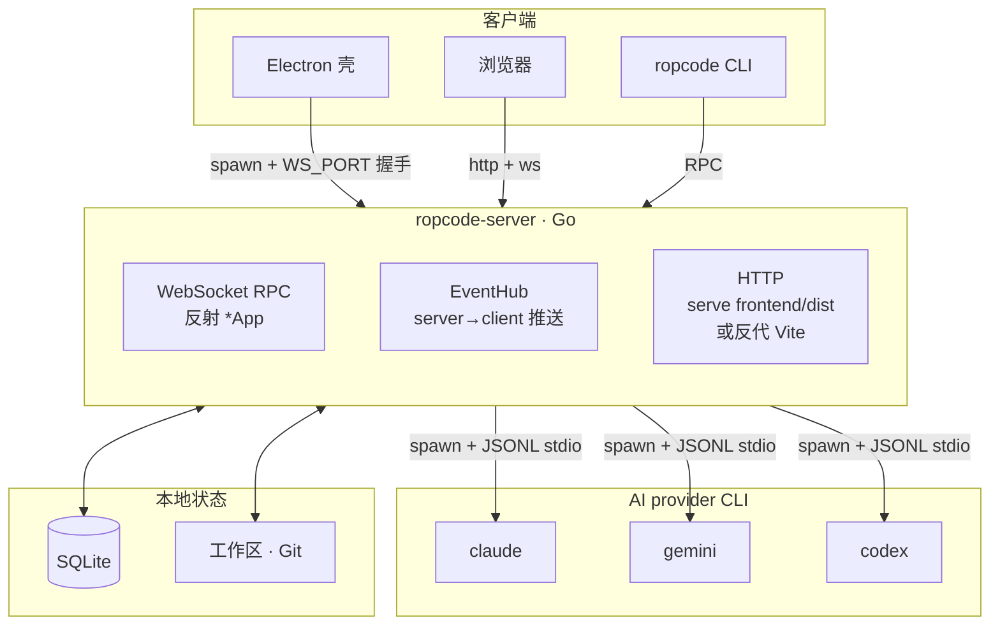

<a id="readme-top"></a>

<p align="center">
  
</p>

<h1 align="center">Ropcode</h1>

<p align="center">
  <strong>一个工作区，多个 AI 代理。</strong><br/>
  让 Claude Code、Gemini、Codex 在同一个项目上并肩工作 —— 在一个真正的桌面 IDE 里。
</p>

<p align="center">
  <a href="https://github.com/RubinCarter/ropcode/releases"></a>
  <a href="LICENSE"></a>
  
  <a href="https://github.com/RubinCarter/ropcode/stargazers"></a>
  <a href="https://github.com/RubinCarter/ropcode/issues"></a>
</p>

<p align="center">
  <a href="README.md">English</a> ·
  <a href="README_CN.md"><strong>中文</strong></a>
</p>

<p align="center">
  <a href="#-为什么选-ropcode">为什么</a> ·
  <a href="#-下载">下载</a> ·
  <a href="#-快速开始">快速开始</a> ·
  <a href="#-工作区">工作区</a> ·
  <a href="#-功能">功能</a> ·
  <a href="#-cli">CLI</a> ·
  <a href="#-架构">架构</a> ·
  <a href="#-从源码构建">构建</a> ·
  <a href="#-路线图">路线图</a>
</p>

<p align="center">
  
</p>

> [!TIP]
> Ropcode 把你已经在用的 AI 编程 CLI（Claude Code、Gemini CLI、Codex）封装进一个真正的桌面 IDE。打开一个项目，你就能**在同一个工作区里并行运行不同 provider 的多个代理** —— 共享同一份文件树、同一个 Git 状态、同一个终端、同一个 diff 视图。

---

<a id="-为什么选-ropcode"></a>

## ✨ 为什么选 Ropcode

- **一个工作区，多个代理。** 项目只开一次。让 Claude 跑测试、Gemini 写文档、Codex 重构模块 —— 全部共享同一份文件、Git 和终端。
- **看见代理在思考、在动手。** 实时子代理进度、流式 transcript、并排 diff、集成 xterm —— 全部接到同一个会话里。
- **是个真正的产品，不是脚本封装。** 一份 Go 模块产出三个二进制 —— Electron 壳、无头 `ropcode-server`、`ropcode` CLI —— 共用同一套 WebSocket RPC 内核。
- **跨平台，跨形态。** 原生 macOS / Linux / Windows 构建。Go 后端自带 HTTP 服务，所以同一个实例既能在浏览器里用，也能在手机上用。

---

<a id="-下载"></a>

## 📥 下载

预构建安装包发布在 [**Releases**](https://github.com/RubinCarter/ropcode/releases/latest) 页面。

| 平台 | 格式 | 架构 |
| --- | --- | --- |
| macOS | `.dmg` | Apple Silicon (arm64) · Intel (x64) |
| Windows | `.exe` (NSIS) | x64 |
| Linux | `.AppImage` · `.deb` | x64 |

> [!IMPORTANT]
> **Ropcode 是 AI 编程 CLI 的可视化外壳 —— 你需要先自己装好至少一个底层 CLI：**
>
> - [Claude Code](https://docs.anthropic.com/en/docs/claude-code) —— `npm install -g @anthropic-ai/claude-code`
> - [Gemini CLI](https://github.com/google-gemini/gemini-cli) —— `npm install -g @google/gemini-cli`
> - [Codex](https://github.com/openai/codex) —— 参考 OpenAI 官方安装指南
>
> 启动 Ropcode 之前，确保 CLI 已经在 `PATH` 里。

---

<a id="-快速开始"></a>

## 🚀 快速开始

1. **至少装一个 provider CLI**（Claude Code、Gemini CLI 或 Codex —— 见上）。想混用就装多个。
2. **下载 Ropcode**：从 [Releases](https://github.com/RubinCarter/ropcode/releases/latest) 选你的系统下载并安装。
3. **打开一个工作区**：启动 Ropcode → *Open Project* → 选一个文件夹 → 开始对话。

就这样。从第一次按键开始，标签、会话、diff、Git 状态全是实时的。

---

<a id="-工作区"></a>

## 🗂️ 工作区：一个项目，多个代理

Ropcode 里的**工作区**就是一个项目目录。打开一次，你就有了一份共享上下文 —— 这个工作区里的每一个代理都能看到它。

在同一个工作区里，你可以：

- 🤝 **并行跑多个 CLI 的会话** —— 让 Claude、Gemini、Codex 在*同一份*代码上并肩工作。不用复制文件，不用重启状态。
- 🧠 **按任务挑模型。** 一个 provider 做重构，另一个写测试，第三个写文档 —— 切换之间不丢对话历史。
- 📁 **共享一份文件树、一个 Git 状态、一个终端、一个 diff 视图**，整个工作区里所有会话都共用。
- 💾 **重启自动恢复。** 会话、待发送 prompt、对话历史全部按工作区持久化。

也可以同时打开多个工作区，每个一个 tab —— 跨项目并行（比如后端 + 移动端 + 设计系统）和上面一样自然。

CLI 也是按工作区思考的：每一条 `ropcode workspace ...` 命令都用 `--cwd` 指向 GUI 看到的同一个工作区。详见下面的 [CLI](#-cli) 章节。

---

<a id="-功能"></a>

## 🎯 功能

### 🌍 多 provider AI

按会话、按工作区自由切换 Claude / Gemini / Codex —— 也可以让它们同时跑。可以钉住常用模型、配置自定义 API endpoint，把不同任务分发到不同 provider，全程不用重启。

### 🧠 并行代理会话

想开多少工作区和会话都行，每个都在自己的 tab 里，有独立的工作目录、模型和对话历史。重启后会话自动恢复，连还没发出去的待处理 prompt 都能保留。

### 👥 实时子代理进度

当 Claude 派生子代理或后台任务，Ropcode 会在分组面板里逐条追踪，并实时加载 transcript。哪个子代理在做什么、什么时候启动、什么时候完成、产出了什么 —— 一目了然，不用再翻一屏 stream-json。

### 🔀 并排 diff 查看器

代理改过的每一个文件都会在右侧栏点亮，配并排 diff 和行内变更跳转。审、确认、或者直接跳到编辑器里继续改。

### 🖥️ 集成终端

完整 xterm.js，带 WebGL 渲染、Powerline 友好的 Unicode 11、网页链接和搜索。开发服务器和代理并排跑，不用再切 app。

### 🌳 实时 Git 状态

Go 原生文件监听，Git 状态变了立刻推到 UI。分支、ahead/behind、modified/staged —— 永远是当前状态，不需要手动刷新。

### ⚡ 斜杠命令与能力选择器

输入 `/` 即可铺开当前会话所有可用命令：内置命令、项目命令、用户命令、skills —— 全部统一在一个选择器里，启动时已预热缓存，菜单秒开。

### 🔌 MCP 服务器管理

在专门的 UI 里浏览、配置、开关 Model Context Protocol 服务器。挂工具和数据源不用再手改 JSON。

### 🔄 多实例切换

同一台机器跑多个 Ropcode 实例，从标题栏直接切换。工作和私人项目完全隔离很方便。

### 📊 用量分析

token 消耗、模型分布、每日趋势、按工作区汇总。在账单暴雷之前发现失控的代理。

### 📱 移动端友好

因为 Go 后端自己 serve UI，把手机浏览器指向运行中的 `ropcode-server` 就能直接用 —— 底部 tab、iOS 键盘适配、WebSocket 自动重连，全套响应式布局。

### 🌐 SSH 远程项目同步

通过 SSH 把远程机器上的项目拉到本地，干完活再同步回去。内置功能，不用额外装服务。

---

<a id="-cli"></a>

## ⌨️ CLI

Ropcode 不只有 GUI。同一个 `ropcode-server` 暴露了一套类型化的 RPC 接口，自带的 `ropcode` CLI 就是它的另一个客户端 —— GUI 在另一个窗口里开着的同时，你可以在 shell 里脚本化地驱动代理。所有命令都通过 `--cwd` 锁定到对应的工作区。

```bash
# 给一个工作区发 prompt（自动用当前 provider，或用 --provider 指定）
ropcode workspace send --cwd ./my-project --prompt "为 auth 模块加单元测试"

# 同一个工作区，切到另一个 provider —— 并行跑
ropcode workspace send --cwd ./my-project --provider gemini --prompt "起草 README"

# 跟踪日志
ropcode workspace logs --cwd ./my-project --follow

# 查看状态快照
ropcode workspace status --cwd ./my-project

# 在 TUI 里 attach 一个运行中的会话
ropcode runtime tui --instance <id>
```

Electron app 可以从应用菜单（`Help → Install Ropcode CLI`）一键把 CLI 装到 `PATH`，也可以单独构建 —— 见 [从源码构建](#-从源码构建)。

---

<a id="-与-opcode-有什么不同"></a>

## 🤔 与 opcode 有什么不同？

Ropcode 受 [opcode](https://github.com/winfunc/opcode) 启发，但是从零开始重写，技术栈和产品边界都更宽：

| | **Ropcode** | **opcode** |
| --- | --- | --- |
| 桌面框架 | Electron | Tauri |
| 后端语言 | Go | Rust |
| AI provider | Claude · Gemini · Codex | 仅 Claude |
| 单工作区多 CLI | ✅ 让多 provider 在同一个项目上并肩 | — |
| 独立 CLI | ✅ 通过 RPC 接同一个 server | — |
| 无头服务模式 | ✅ 不装 Electron 也能用浏览器跑 | — |
| 实时 Git 监听 | ✅ | — |
| MCP 集成 | ✅ | ✅ |
| SSH 远程项目同步 | ✅ | — |
| 多实例 | ✅ | — |
| 移动端响应式 | ✅ | — |
| 许可证 | AGPL-3.0 | AGPL-3.0 |

如果你接受 Tauri/Rust 栈、只用 Claude，opcode 是个好选择。Ropcode 适合想要**一个产品横跨桌面/浏览器/手机/CLI、跨多 provider** 且不介意 Go 后端的人。

---

<a id="-架构"></a>

## 🏗️ 架构

一个 Go 模块、三个二进制、一个 WebSocket RPC 内核。



**一份模块，三个运行形态：**

- **`ropcode-server`** —— Go 写的 WebSocket 后端。可以独立运行，也可以被 Electron 拉起。挑一个空闲端口，输出 `WS_PORT:<port>`，然后自己 serve 前端（dev 模式反代 Vite，prod 模式直接 serve `frontend/dist`）。**浏览器永远只跟 Go 通信，不直接连 Vite。**
- **Electron 壳** —— 把 `ropcode-server` 作为子进程拉起，生成本次会话的 auth key，加载窗口指向 Go 服务。
- **`ropcode` CLI** —— 拨同一个 WebSocket，复用同一套 RPC 类型。

**两个值得一提的设计选择：**

- **反射式 RPC。** `internal/websocket/router.go` 反射 `*App` 上每一个导出方法，自动暴露成 RPC endpoint。新增一个前端可调的 API：写一个 Go 方法 + 在 `frontend/src/lib/rpc-client.ts` 加一个类型化包装 —— **不需要手写路由表**。
- **单一推送通道。** `internal/eventhub/hub.go` 是 server→client 事件的唯一出口（`git:changed`、`process:changed`、`session:changed` 等等）。各 manager 通过小适配器结构体发事件，未来更换传输层抽象不会碎。

更深入的设计笔记见 `CLAUDE.md`、`AGENTS.md`，以及 `docs/plans/` 下按日期归档的设计文档。

---

<a id="-从源码构建"></a>

## 🛠️ 从源码构建

### 前置条件

- Go 1.24+
- Node.js 22+ 和 npm
- `claude`、`gemini` 或 `codex` 之一在 `PATH` 里

### 开发模式

```bash
make dev
```

它会构建 Go 服务器、启动 Vite、拉起 Electron 窗口 —— 三者通过上文的 `WS_PORT` 握手串起来。

### 构建可分发产物

```bash
# 当前 OS 的生产构建
make build

# 完整 electron-builder 流水线（DMG / NSIS / AppImage）
npm run build:release
```

### 常用命令

| 命令 | 用途 |
| --- | --- |
| `npm run build:go` | 构建 server（`-tags server`）和 CLI（按平台目录） |
| `npm run build:cli:dev` | 仅构建 CLI，扁平输出到 `bin/ropcode` |
| `go test ./...` | 跑所有 Go 测试 |
| `cd frontend && npm run build:typecheck` | 前端 typecheck + 构建 |
| `cd electron && npm test` | Electron 主进程测试 |

> [!NOTE]
> 直接 `go build .` **不会**产出可运行的服务器 —— `server_main.go` 在 `server` build tag 后面。一定要带 `-tags server`，或者用上面的 npm 脚本。

---

<a id="-路线图"></a>

## 🗺️ 路线图

接下来在排期上的几件事（进度跟踪在 [Issues](https://github.com/RubinCarter/ropcode/issues)）：

- 📐 Context 占用细分 UI（system / tools / history / memory / MCP）
- ⏪ 文件 checkpoint 与 rewind
- 🧩 MCP 服务器热切换、重连和 elicitation 支持
- 🪝 Hook 系统集成（在 tool-use 事件上跑 host 端代码）
- 🧪 直连 Anthropic / OpenAI / Gemini API 的模式（不走 CLI 包装）

每一项的详细设计文档在 `docs/plans/`。

---

<a id="-参与贡献"></a>

## 🤝 参与贡献

issue、讨论、PR 都欢迎。

- 🐛 发现 bug？开一个 [issue](https://github.com/RubinCarter/ropcode/issues/new) 附上复现步骤。
- 💡 有功能想法？发起讨论，或者直接发草稿 PR。
- 🔧 想发修复？最常用的两个命令是 `make dev` 和 `go test ./...`。

如果你要动 `*App` 上的导出方法，先 grep 一下 `frontend/src/lib/rpc-client.ts` —— 这些签名是反射暴露的，改它们对前端和 CLI 都是 breaking change。

---

<a id="-致谢"></a>

## 🙏 致谢

Ropcode 受 [opcode](https://github.com/winfunc/opcode)（AGPL-3.0，作者 [winfunc](https://github.com/winfunc)）启发。UI/UX 方向欠它很多。出于对原作的尊重，Ropcode 采用相同的 AGPL-3.0 许可证。

---

<a id="-许可证"></a>

## 📜 许可证

[GNU Affero General Public License v3.0](LICENSE) —— 版权所有 © 2024-2025 Rubin。

如果你以网络服务的形式分发 Ropcode（无论是否修改），必须向用户提供对应的源代码。

<p align="right"><a href="#readme-top">↑ 回到顶部</a></p>
